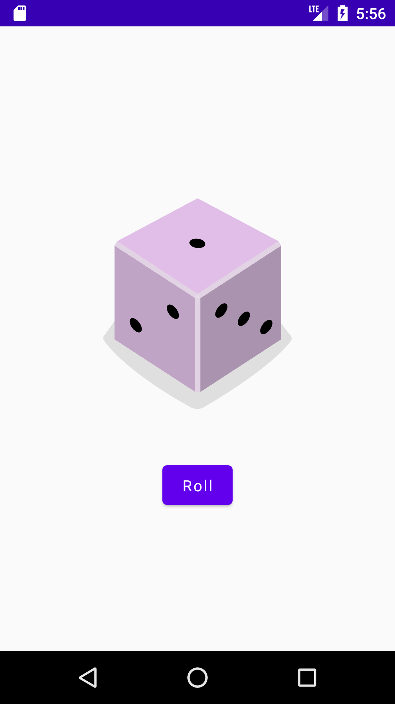

# Dice Roller

An Android app built with Kotlin and Jetpack Compose for rolling virtual dice.

## Screenshot



## Getting Started

These instructions will get you a copy of the project up and running on your local machine for
development and testing purposes.

### Prerequisites

- Android Studio 4.1 or higher
- Android SDK 21 or higher
- AndroidX Jetpack libraries
- Kotlin 1.3.71 or higher
- The Android Gradle Plugin version 4.0.0 or higher

### Installing

1. Clone the repository ```sh git clone https://github.com/gentildpinto/DiceRoller.git```
2. Open the project in Android Studio
3. Build and run the app on an emulator or connected device

## Built With

- [Kotlin](https://kotlinlang.org/) - The programming language used
- [Jetpack Compose](https://developer.android.com/jetpack/compose) - UI toolkit for building
  natively compiled applications

## Authors

- **Gentil Pinto** - [gentildpinto](https://github.com/gentildpinto)

## Acknowledgments

- Inspired by
  the [Google Codelab on Android Basics with Compose](https://developer.android.com/courses/android-basics-compose/course)
